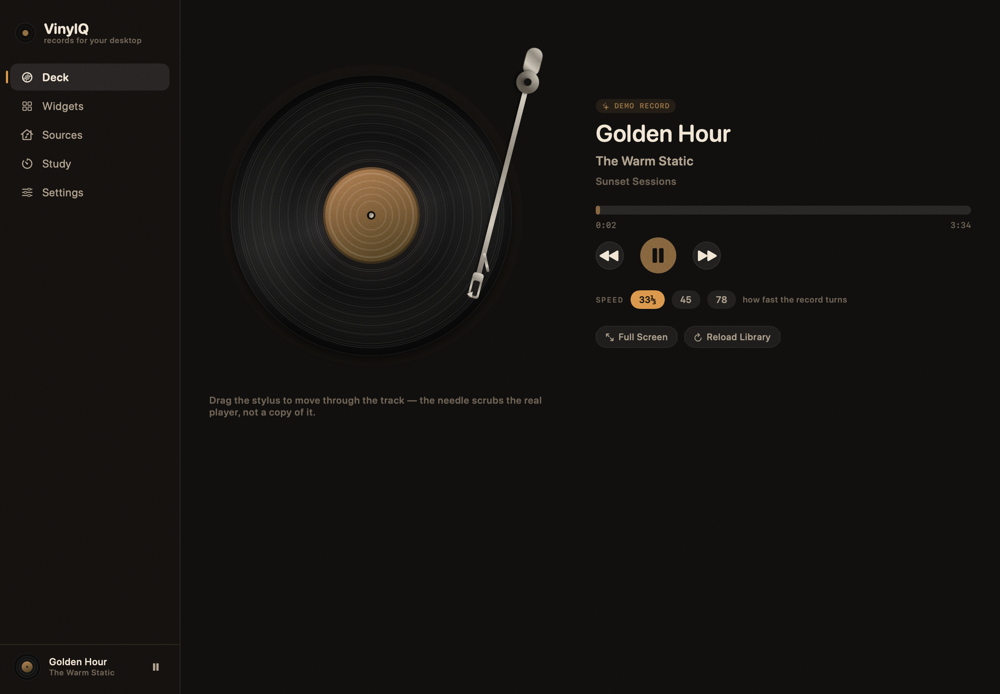
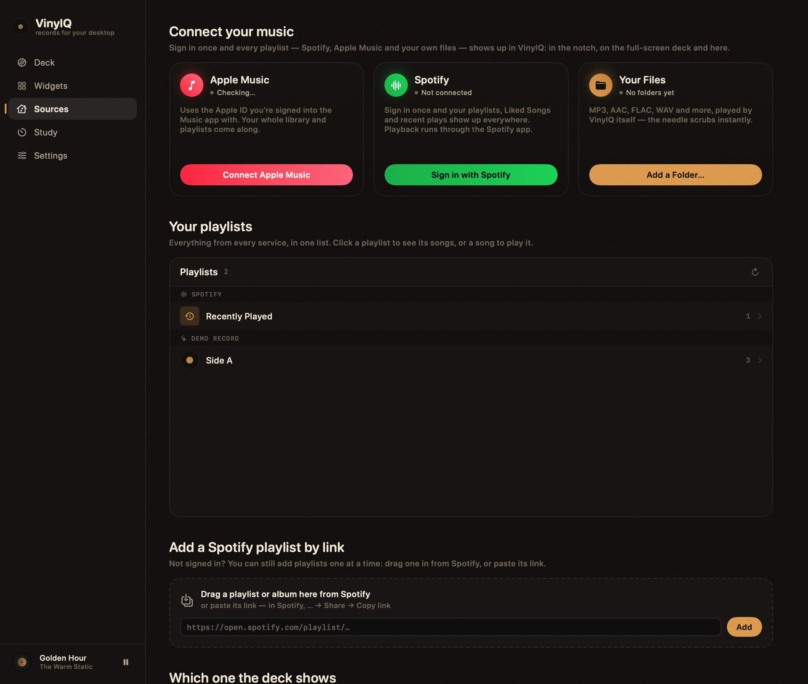
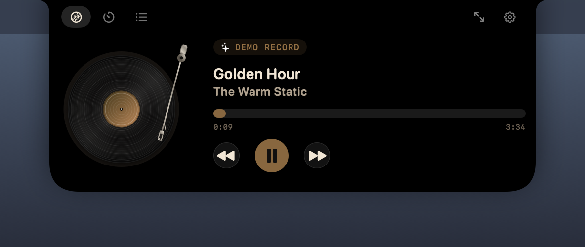
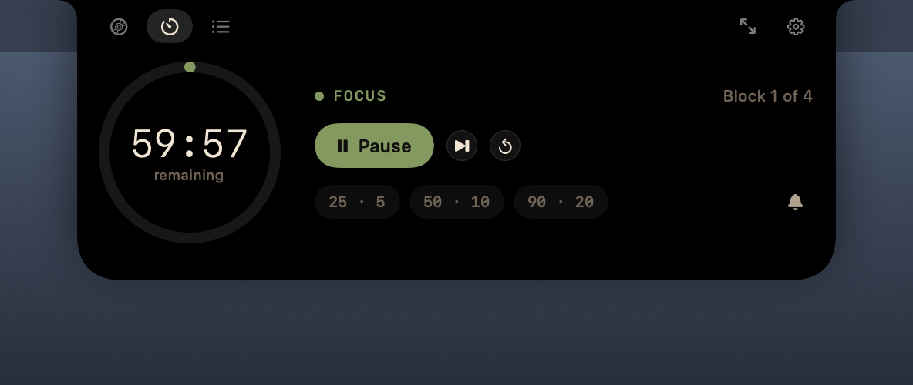
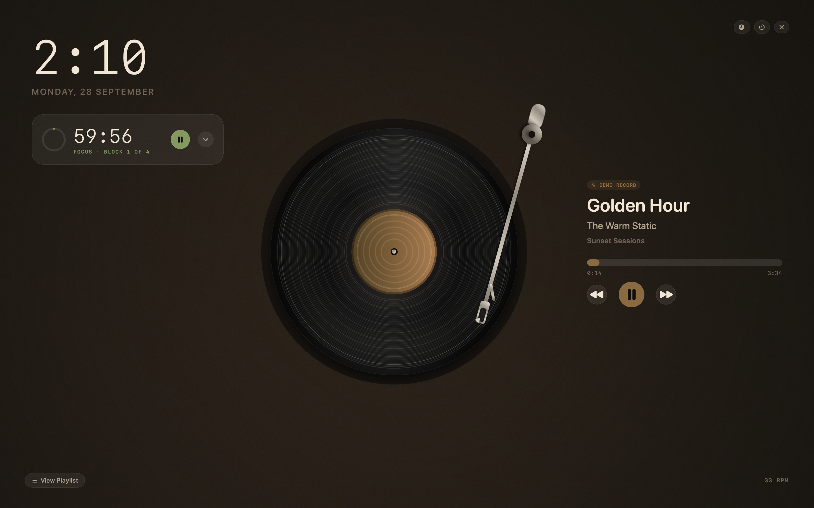
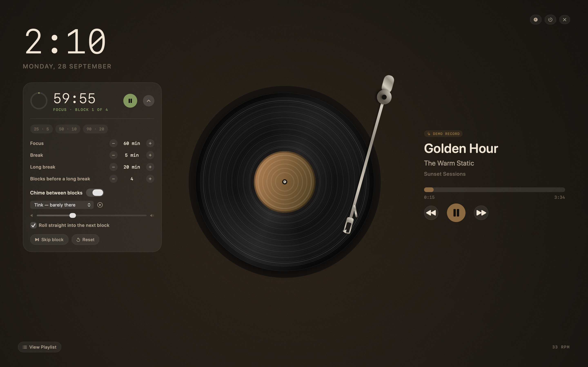
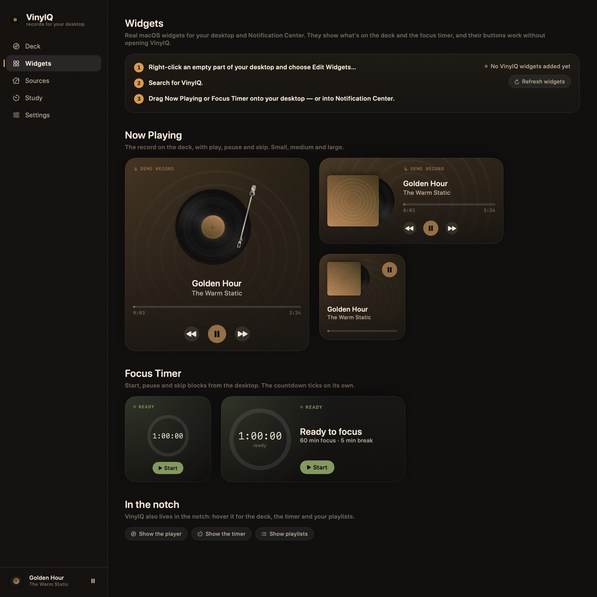
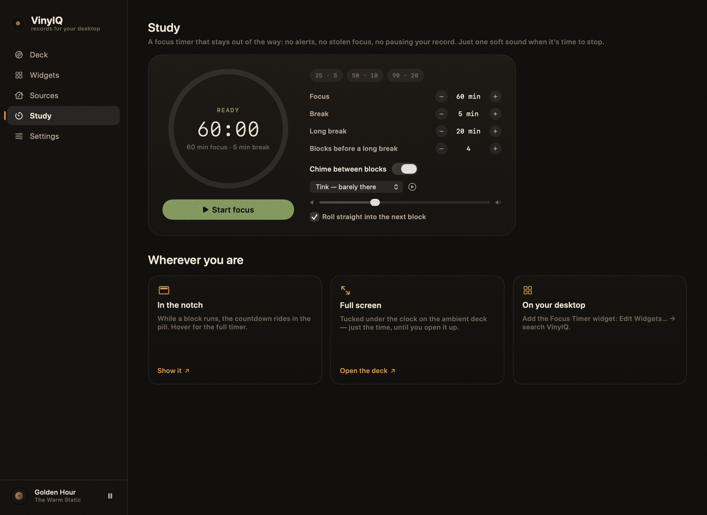

# VinylQ

A record player for your Mac. VinylQ puts a turntable in the notch, across the
whole desktop, on your desktop as real widgets, and in a small app window — and
plays the music you already have, from Spotify, Apple Music and your own files,
all in one place.



## Download

Grab **VinylQ.zip** from the [latest release](https://github.com/yousifnawar/VinylQ/releases/latest),
unzip it and drag `VinylQ.app` to Applications.

The release build isn't notarized, so macOS will refuse the first launch.
Right-click the app → **Open** → **Open**, or run
`xattr -dr com.apple.quarantine /Applications/VinylQ.app`. Desktop widgets need
a build signed with your own Apple Development certificate — use `./build.sh`
below for those.

## Quick start

```bash
./build.sh --run
```

That builds the app and its widgets with Xcode, installs `VinylQ.app` in
`/Applications` (with `build/VinylQ.app` as a shortcut to it) and launches it.
`./build.sh debug` builds faster; `./build.sh` alone builds and installs, and
restarts VinylQ if it was running.

On first launch VinylQ spins a demo record. Connect your music from **Sources**.

## Connecting your music



| Source | Connect | Now playing & transport | Stylus seek | Playlists |
|---|---|---|---|---|
| Spotify | Sign in with Spotify | ✅ | ✅ | ✅ all of them, Liked Songs, recent plays |
| Apple Music | one click | ✅ | ✅ | ✅ your whole library |
| Your files | pick a folder | ✅ | ✅ instant | ✅ folders |

**Spotify** signs in the same way Cascade does: Spotify's own sign-in sheet,
once, then every playlist, your Liked Songs and your recent plays are in the
browser. It uses the same Spotify developer app as Cascade — the Client ID and
the `cascade://callback` redirect in `Sources/VinylQ/Config/SpotifyConfig.swift`
— so nothing new is needed on Spotify's side. Sign-in is PKCE: no client secret,
and the refresh token goes in the Keychain. Playback, the needle and seeking go
through the Spotify app over Apple Events, so they work on Free and Premium.

Since February 2026 Spotify only shares the *songs* of playlists you own or
collaborate on. Playlists you just follow are still listed, and play as a whole.
You can also drag any playlist or album in from Spotify, or paste its link.

**Apple Music** connects in one click: VinylQ opens the Music app if needed and
macOS asks once whether VinylQ may control it. It uses the Apple ID Music is
signed into. Your playlists stay in the browser even while Music is closed;
picking one opens Music in the background.

## The notch

A pill sits in the notch — pure black, flush with the top of the screen, so it
reads as the notch itself being a little wider. A spinning label on one side,
four bars on the other; while a focus block runs, the countdown rides in it.


When a new song starts, the notch drops down for a moment to name it
(Settings → Notch → Show each new song).


Hover it and the notch grows into a small deck — a live turntable with a
**draggable stylus**, transport, and tabs either side of the notch for the
**timer** and your **playlists**.




Why it's smooth: the panel's window is created once, at the size of the largest
thing it will show, and never resized. Opening is a single spring on one
animatable shape; the window takes the mouse only where that shape is drawn, so
it never swallows a click meant for the menu bar. The turntable is drawn in
layers — the platter is rendered once and cached, and each frame only rotates
the label, the sheen and the arm — so it spins at the display's full refresh
rate.

## The ambient deck

⌘⇧F, or **Full Screen** anywhere in the app. The display becomes a record
player: the clock with the focus timer tucked under it, a large deck, and the
cover art washed out behind. The buttons fade after a few seconds of stillness.
`esc` leaves.



The timer is just a timer until you open it: its chevron reveals presets,
block lengths and the chime, right where it sits.



## Widgets



Real macOS widgets for the desktop and Notification Center:

* **Now Playing** — small, medium and large. The sleeve with its record slid
  out, the title, a progress bar that runs on its own, and working play, pause
  and skip buttons. The large one shows the whole deck, needle in the groove.
* **Focus Timer** — small and medium. A live countdown and ring, with start,
  pause and skip.

To add them: right-click the desktop → **Edit Widgets…** → search **VinylQ**.

The buttons are App Intents, so they act without bringing VinylQ forward. The
widget extension is sandboxed; VinylQ hands it what's playing through the one
folder it's allowed to read (`~/Library/Application Support/VinylQ/Widgets`),
and it answers taps with a distributed notification. If VinylQ isn't running, a
tap opens it.

## Study mode



A focus timer that stays out of the way: no alerts, no stolen focus, and it
never pauses your record. Pick a preset or set the focus and break lengths and
how many blocks go by before a long one. When a block ends you get one soft
chime — or none. It's in the notch, on the full-screen deck, in the Study room
and on your desktop.

## Signing

macOS only runs desktop widgets from a properly signed extension. `build.sh`
signs with your **Apple Development** certificate — the free one Xcode creates
when you sign in with your Apple ID (Xcode → Settings → Accounts). With several
certificates it prefers the one in your own name; pick another with
`VINYLQ_SIGN_IDENTITY="Apple Development: …" ./build.sh`. A stable signature
also means macOS remembers the Automation permission across rebuilds. Without a
certificate the build falls back to an ad-hoc signature: the app works, the
widgets won't load.

The bundle identifier is still `app.wax.deck`, from before the app was renamed,
so settings and permissions carried over.

## Permissions

* **Automation** — to read and control Music and Spotify. Asked once per app.
  If you refuse, VinylQ says so and everything else keeps working.
* **Login item** — optional, in Settings.

## Layout

```
VinylQ.xcodeproj    Two targets: the app, and the widget extension
Sources/
  VinylQ/           The app
    Config/         Spotify sign-in settings (shared with Cascade)
    Core/           PlayerEngine (the single source of truth), connections,
                    the study timer, the widget bridge, artwork processing
    Providers/      One per source, behind the MusicProvider protocol
    Notch/          The panel that lives in the notch
    Ambient/        Full-screen deck and clock
    Timer/          The focus timer's views, used everywhere it appears
    Main/           The app window and its five rooms
    Views/          Live turntable, transport, playlists
    Support/        Apple Events, Keychain, the snapshot tool
  Shared/           Compiled into both targets: theme, deck drawing,
                    widget state and the widgets' designs
  VinylQWidgets/    The widget extension: providers, App Intents
Packaging/          Info.plists, entitlements, the icon renderer
```

`PlayerEngine` polls the active source once a second and publishes only when
something visible changes — a new track, play or pause, a seek. The needle's
steady march isn't a change: views extrapolate it from an anchor inside their
own animation timelines. Script failures are logged once each under the
`app.wax.deck` subsystem (`log show --predicate 'subsystem == "app.wax.deck"'`).

## Regenerating the screenshots and the icon

```bash
./build.sh debug
build/xcode/Debug/VinylQ.app/Contents/MacOS/VinylQ --render Screenshots
Packaging/make-icon.sh
```

The renderer hosts each real view in an off-screen window and captures it, so
the images are the actual app rather than a mock-up.

## Known limits

* Widgets redraw on their own for the progress bar and the countdown, but a new
  song needs macOS to reload them, and macOS rations reloads for every app's
  widgets. On a long listening day a widget can lag a track behind.
* Spotify only lists the songs of playlists you own or collaborate on; the rest
  play as a whole. Its Development Mode also caps an app at five users.
* The RPM switch is visual. It changes how fast the record turns, not the music.
* Apple Music artwork comes from whatever Music.app has cached locally.
* The notch pill sits over a sliver of the menu bar on each side of the notch.
  That's unavoidable: nothing can draw inside the notch itself.
